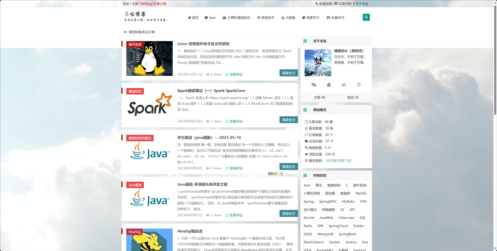
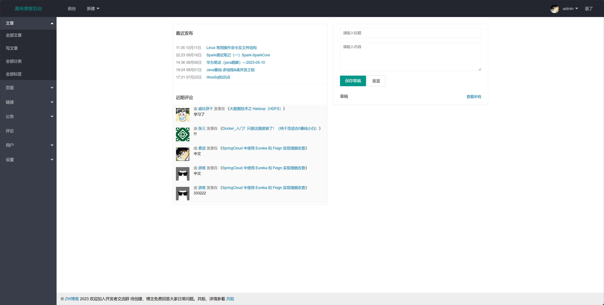

# 项目描述
本项目基于SSM实现的个人博客系统，适合初学SSM和个人博客制作的同学学习。 
参考链接：https://github.com/saysky/ForestBlog
# 界面效果
## 前台效果

## 后台效果图

# 使用注意
## 1.开发工具的选择
请使用 IntelliJ IDEA, 尽量不要用 Eclipse/MyEclipse，使用前者项目起不来我可以帮忙解决，后者直接忽视(理论上可以起)
## 2.仅供个人学习使用